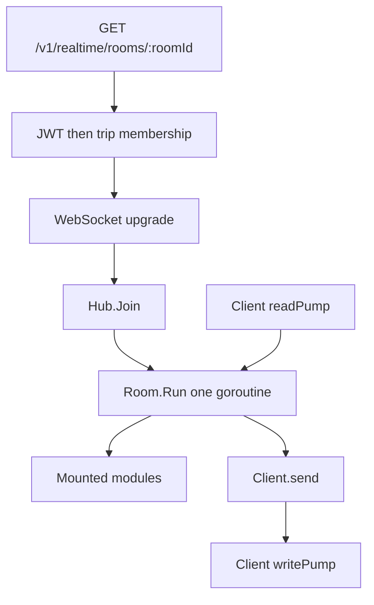

# Realtime rooms

The websocket runtime for a live trip. This page is the map for the next modules (tracking first, chat later). The annotated walkthrough of the original single-file sketch stays in [docs/research/realtime](research/realtime/road2d_websocket_main_explanation.md).

## What this package owns

`module/realtime` is the connection runtime only:

- one room per id, one goroutine owns that room
- one live socket per user; a new socket replaces the old one
- read and write pumps, ping/pong, a bounded send buffer
- namespace routing of client messages into a `Module`
- presence, direct send, ordered broadcast, and a lossy latest-value batch

It does not know routes, lives, branches, or chat. Those are modules mounted onto a `Hub`.

## Shape



`cmd/server/run` builds one `Hub`, mounts modules, and passes it to `LobbyController`. Today nothing is mounted, so a joined room only emits presence.

A room id is an opaque string. The lobby authorizer treats it as a trip UUID and allows an active member. A future chat room needs its own authorizer; do not teach `Hub` about trips.

User ids are `uuid.UUID`, the same id as `users.id`. The research sketch used `int64` only because its dev handler parsed a query param.

## The one rule

Only `Room.Run` may touch room state (`clients`, `byUser`, `latest`). That is why `Room` has no mutex. Pumps talk to the room through `register`, `unregister`, and `inbound`.

A `Module` is called on that same goroutine. It must not:

- take a lock to protect its own room state
- call the database or another HTTP API inline
- call back into `Hub` from its factory, or start a goroutine in the factory
- call `Session` outside `OnJoin`, `OnLeave`, `OnMessage`, and `OnTick`

`Session` is the only handle a module gets. Tests fake that interface; they do not spin a room.

A full send buffer means a slow client. The room drops that socket and does not run `OnLeave` inside the send. The write pump then closes the connection, the read pump unregisters, and `OnLeave` runs on a later turn. A module is never re-entered from inside its own callback.

## Wire protocol

Client to server:

```json
{"type":"tracking.location","payload":{"lat":10.1,"lng":106.2}}
```

`type` is `namespace.command`. The room strips the namespace and delivers `command` plus the raw payload to that module. A type with no dot is `system.error` / `invalid_type`. An unknown namespace is `unknown_namespace`.

Server to client:

```json
{"type":"tracking.pong","payload":{}}
```

| type | when | payload |
| --- | --- | --- |
| `system.presence` | a user actually comes online or goes offline | `userId`, `online` |
| `system.error` | this socket sent a bad frame | `code` |
| any type passed to `Broadcast` or `Send` | immediately, in order | module-defined |
| `<type>.batch` | once per 500ms tick | `[{key, value}]`, newest value per key |

Presence is edge-triggered. A reconnect does not emit `online` again, and the replaced socket does not emit `offline`. The module snapshot, sent from `OnJoin`, is how the new socket catches up.

`BroadcastLatest` is the lossy path. Use it for positions. Use `Broadcast` for anything the client must not skip (a life change, an arrival, a branch switch).

JSON fields on this socket are camelCase (`userId`), matching the rest of the API.

## HTTP entry

`GET /v1/realtime/rooms/:roomId`

1. If `Authorization` is missing and `access_token` is present, the query value is copied into `Authorization: Bearer`. Browser sockets cannot set that header. Prefer the header from native clients; the query ends up in access logs.
2. The existing JWT middleware runs, still before the upgrade.
3. `activeTripMemberAuthorizer` requires an active trip member. Anyone else gets 403 and the socket is not upgraded.
4. The connection is upgraded and `Hub.Join` starts the pumps.

`CheckOrigin` currently allows every browser origin. Restrict it to the app origin before this route is exposed beyond local development.

Mount every module before the process accepts connections. A room created earlier does not see a factory registered later.

## How to add a module

1. Put the domain in its own package (`module/tracking`, later `module/chat`). Do not add fields to `Room`.
2. Implement `realtime.Module`. One factory call builds one instance for one room. Keep the room's state on that struct.
3. `OnJoin` must be idempotent. Send the snapshot there with `Session.Send`.
4. `OnLeave` runs only for a real disconnect.
5. `OnMessage` receives the command with the namespace already removed.
6. `OnTick` is every 500ms, including while the room is empty (the room stays up for 5 minutes after the last user leaves).
7. In `cmd/server/run`, before `router.Run`:

```go
if err := hub.Mount("tracking", tracking.NewFactory(...)); err != nil {
    return err
}
```

The namespace is the prefix on the wire (`tracking.location`). Do not mount `system`, an empty name, or a name that contains a dot.

Outbound type strings are whatever the module passes to `Send` / `Broadcast`. Pass the full name (`tracking.offRoute`), not the short command.

## Tracking, the first module to build

The sketch in `docs/research/realtime/main.go` is the tracking behavior. It does not belong in `Room`. Mount it as namespace `tracking`.

The client sends raw observations and intents. It never sends a computed result ("I am off the route"). The server is the authority.

| wire type | was | direction | behavior |
| --- | --- | --- | --- |
| `tracking.location` | `loc` | client to server | rate-limit per user, then `BroadcastLatest` keyed by the user id string |
| `tracking.resync` | `resync` | client to server | `Send` the full snapshot to that user |
| `tracking.switchBranch` | `intent` / `switch_branch` | client to server | accept only when the client's version matches the room; otherwise `Send` `tracking.error` with `stale_version` |
| `tracking.offRoute` | `offroute` | server to room | `Broadcast` when the off-route flag changes |
| `tracking.life` | `life` | server to room | `Broadcast` the new life count |
| `tracking.arrived` | `arrived` | server to room | `Broadcast` once per user per destination |
| `tracking.branch` | `branch` | server to room | `Broadcast` after a branch switch |
| `tracking.snapshot` | `snapshot` | server to one user | version, branch, and each member's position, lives, off-route flag |

Starting rules from the sketch, kept here so they are not copied back into the infra package:

- ignore a location sooner than 900ms after that user's previous one
- off route: farther than 50m from the branch polyline, for 3 samples in a row
- arrived: within 30m of the current target, for 2 samples in a row, once per destination
- lives start at 3; going off route spends one life, then that user is immune for 30s
- a branch switch clears off-route state, because "off the old line" no longer means anything
- position batches use the server clock

`OnTick` is already 500ms, which is the old flush interval. Do not add a second ticker inside the module.

What is still open in the sketch, and should be decided in the tracking package rather than the room:

- where the polyline and the current target are loaded (maps / trip). The factory may read a cache. It must not call `Hub`.
- who may `switchBranch` (trip role, and any vote the product adds)
- what happens at 0 lives

Geometry helpers from the sketch (`haversine`, distance to a polyline) move with the tracking package. Chat must not see them.

## Idle rooms and shutdown

A room with no live user closes after 5 minutes and drops itself from the hub only if it is still the room stored under that id. A join that loses the race with that close retries once. There is no process-wide shutdown drain yet: stopping the server closes sockets because the process exits.
