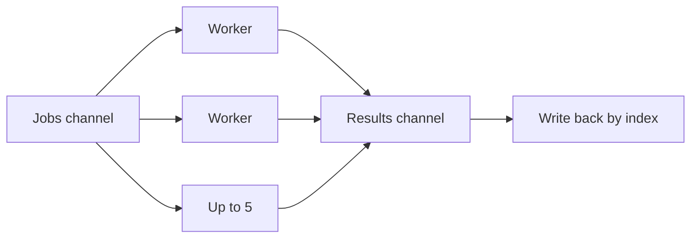

# Planning, route, and trip

How a planned ride becomes a route. Graph rules (main branch, split, merge, `openTail`) stay in the [README](../README.md#trip-graph-input-graphbranch). This page is the technical half: services, the worker pool, the four models, and the caches.

Covered work starts at `88a3f9c`.

## Contents

- [How a ride is planned](#how-a-ride-is-planned)
- [Location and destination](#location-and-destination)
- [Leg and travel](#leg-and-travel)
- [Services](#services)
- [Worker pool](#worker-pool)
- [Storage tiers](#storage-tiers)
- [Preview one branch](#preview-one-branch)
- [Compute the saved graph](#compute-the-saved-graph)
- [Not built yet](#not-built-yet)

## How a ride is planned

```mermaid
flowchart TD
  create[Create trip] --> fork[Fork a location into a destination]
  fork --> graph["PUT /trips/:id/graph"]
  graph --> preview["POST /trips/:id/compute"]
  preview --> look[Polyline only, trip unchanged]
  graph --> lock[Lock the trip]
  lock --> later[ComputeTrip reuses a frozen Travel]
```

1. Create the trip and invite members.
2. Fork a verified `Location` into a `Destination`. The pin keeps its own lat/lng.
3. The leader calls `PUT /trips/:tripId/graph` while the trip is `planning`. The body is destination ids per branch, plus `openTail`.
4. Any active member calls `POST /trips/:tripId/compute` to preview one branch. That branch does not have to match the saved graph, and nothing is written onto the trip.
5. `TripLocked` exists on the status enum. Nothing sets `Travel.IsFrozen`, and no handler calls `ComputeTrip` yet.

Goong Trip is not used. That API is a single-vehicle TSP: it needs at least 10 points and it reorders stops. A branch already has an order, so each hop is one Directions call, vehicle `bike`.

## Location and destination

A `Location` is a verified place in the shared catalog (`place_id`, address, lat/lng). Seeding and place detail write it. Planning never updates it.

A `Destination` is a pin on a ride. `PlaceService.ForkLocation` copies the location's name and coordinates onto a new pin, sets `LocationID`, and leaves the pin in `editing`. After the link is set, the pin's coordinates are a copy and are no longer editable. A destination has no `TripID`, so two trips can share one pin.

The saved graph stores destination ids only, through `TripBranch` and ordered `BranchDestination` rows. A location never sits on that graph. The preview endpoint is the one place that accepts either id, because a member may try a catalog place that has not been forked yet.

```text
Location (catalog, shared)
    │ fork copies lat/lng
    ▼
Destination (pin, no trip id)
    │ ordered by BranchDestination
    ▼
TripBranch → Trip
```

## Leg and travel

A `Leg` is the road between two coordinates for one vehicle. It does not know which pin or which trip asked for it. Two pins dropped on the same spot share one leg. The key is `(from_lat, from_lng, to_lat, to_lng, vehicle)`, index `idx_leg_cache`. The row holds the polyline, distance, duration, and turn steps.

A `Travel` is one hop of one trip, between two destination ids. The key is `(trip_id, from_destination_id, to_destination_id, vehicle)`, index `idx_travel_pair`. Trip A freezing A→B does not block trip B from storing its own A→B. `LegID` is set only when the leg already has a Postgres id. A leg that lived only in Redis leaves `LegID` empty. `IsFrozen` stays false while computing. A frozen row is the snapshot kept for a shared history, and it never expires.

`TravelGraph` is `[][]Travel`, one inner slice per branch, in stop order. A branch shorter than two stops keeps an empty slice so branch indexes stay aligned.

## Services

Handlers construct a service per request. The interfaces below are declared in the consumer package, and each one lists only the methods that consumer calls.

| Service | File | Does |
| --- | --- | --- |
| `TripBranchService` | `module/trip/service/TripBranchService.go` | Resolves destination ids, checks branch rules, replaces the trip's branches |
| `PlaceService` | `module/trip/service/PlaceService.go` | Reads a location or destination, forks a location into a pin |
| `ComputeTripService` | `module/trip/service/ComputeTripService.go` | `PreviewBranch` for one ad-hoc branch, `ComputeTrip` for a saved graph |
| `DirectionService` | `module/maps/service/DirectionService.go` | One A→B route: cache, then Goong, then cache again |

`ComputeTripService` depends on four narrow interfaces:

- `LegRouter` is `DirectionService.Route`.
- `TravelStore` is `TravelRepository` (`FindTravelsByTrip`, `UpsertTravels`). `PreviewBranch` never calls it.
- `DestinationPointFinder` and `LocationPointFinder` load one pin or one place. Only `PreviewBranch` uses them.

`DirectionService` depends on `LegStore` (`Find`, `Upsert`). Which store is passed decides whether a write reaches Redis, Postgres, or neither. The service itself does not know.

`maps/service.TripService.Optimize` is the Goong TSP playground. It is not this trip.

## Worker pool

Both `ComputeTrip` and `PreviewBranch` fan out with the same pool. `computeWorkers` is 5, the same burst as the Goong limiter (`freeRateLimit` on `GoongClient`). Every Directions call waits on that limiter before the HTTP request, so a goroutine past the fifth does not add throughput. The running count is `min(5, number of jobs)`.



The steps in `routeJobs` and `previewRoutes`:

1. `context.WithCancel` wraps the request context.
2. `jobs` and `results` are buffered to the job count, so a worker can finish without waiting for the collector.
3. Workers start and range over `jobs`. The caller then sends every job and closes `jobs`. A closed, drained channel is what ends the worker loop.
4. A side goroutine waits for the workers and then closes `results`. The collector ranges until that close.
5. Each result carries the index it came from. Completion order is not branch order, so the collector writes `result[branch][leg]` (or `legs[i]` for a preview).

On the first error a worker sends on `errCh` (buffer 1, so the send does not block) and cancels the context. `limiter.Wait` and the HTTP call in flight then return. Other workers see `ctx.Err()`, skip `Route`, and still drain `jobs` so the closed channel can finish. They do not report that cancel as a second error. The caller returns the first error and drops the partial graph.

`ComputeTrip` dedupes before the pool. The job key is `lat,lng|lat,lng|bike`. One Goong call fills every slot that shares those coordinates, and each slot still stores its own destination ids. That split matters: the travel key is the pin ids, not the coordinates.

`PreviewBranch` does not dedupe. Each consecutive pair is its own job. A repeated coordinate pair becomes two `Route` calls, and the second is a cache hit.

`Route` is called with `Alternatives: false`. `true` would skip the leg cache inside `DirectionService`.

## Storage tiers

```text
PreviewBranch
  shortTTLLegStore  →  Redis only, TTLSeconds = 900
  no Redis          →  noop store, Goong result is not kept

DirectionService on the playground, and ComputeTrip
  CachedLegStore
    1. Redis          key leg:lat,lng|lat,lng|vehicle
    2. Postgres legs  idx_leg_cache, expired row counts as a miss
    3. Goong
  write order: Postgres first, then Redis, so the cached payload has the row id

ComputeTrip, after the legs exist
  Postgres travels   idx_travel_pair, TRAVEL_TTL_SECONDS default 86400
```

`LegStore.Find` returns `nil, nil` for a miss. That is not an error. `DirectionService` treats it as "call Goong".

Redis expiry is the TTL of the key. `LEG_CACHE_TTL_SECONDS` defaults to 86400. If the leg's own `TTLSeconds` is greater than 0, `LocationLegMemoryStore.Upsert` uses that instead. Postgres rows are not deleted when they age out. `LegRepository.Find` treats an expired row as a miss and leaves it, so the next upsert hits `idx_leg_cache` and overwrites it. `Leg.Expired` uses the row's `TTLSeconds` when that is positive, otherwise the caller's fallback window.

`CachedLegStore.Find` reads Redis first. A Redis error is logged and the lookup continues to Postgres. A Postgres hit is written back into Redis. `Upsert` writes Postgres first. The driver returns the row id, and only then is the same struct stored in Redis.

The preview wrapper sits in front of the same Redis store and sets `TTLSeconds = 900` on write. `DirectionService` upserts only after a miss, so a key that is still alive keeps the TTL it already has. A preview miss and a durable miss share the key shape `leg:…`. A short preview entry can therefore satisfy a later durable read until those 15 minutes run out. A durable entry that is already in Redis is not shortened by a preview.

`ComputeTrip` also reads `travels` before it calls `Route`. A frozen row is reused and is not written again. An unfrozen row inside `TRAVEL_TTL_SECONDS` is reused the same way. Anything else is computed, then upserted. The conflict update skips `is_frozen = true`. Rows are deduped by the travel key before the batch, because Postgres rejects an `ON CONFLICT` batch that touches the same key twice.

A missing Redis on the preview path uses `noopLegStore`: `Find` misses, `Upsert` does nothing, and the handler still returns the Goong result.

Two `GoongClient` values exist, one on the map playground and one on `TripController`. Each has its own 5 req/s limiter. They do not add up to a single shared cap.

## Preview one branch

`POST /v1/trips/{tripId}/compute`

JWT, and an active member. The trip does not have to be `planning`. `tripId` is only the membership check.

```json
{
  "points": [
    { "destinationId": "…" },
    { "locationId": "…" },
    { "destinationId": "…" }
  ]
}
```

Each point carries exactly one id. Neither id, or both, is 400 (`ErrInvalidComputePoint`). Fewer than two points is not a hop. An unknown id is 404.

`PreviewBranch` loads each point, builds consecutive pairs, and runs the pool. The response `legs` carry the name and id of each end, `vehicle`, `polyline`, `distanceM`, and `durationS`. There is no `tripId` and no `isFrozen`.

Goong errors: missing API key is 500, rate limit is 429, an empty route or a non-OK status is 502.

## Compute the saved graph

`ComputeTrip(ctx, tripID, graph)` takes a resolved `GraphBranch` (`[][]Destination`), not raw ids. No handler calls it.

The result is a `TravelGraph`. Reused rows keep the database `ID` and `IsFrozen` flag. Fresh rows are built by `travelFromLeg`: pin ids come from the slot, metrics come from the leg, and `IsFrozen` is false.

## Not built yet

- No HTTP route calls `ComputeTrip`, so `travels` is not written from a request.
- Nothing sets `IsFrozen` to true.
- Replacing the graph does not delete old travels.
- Preview does not check that a point belongs to the trip's saved graph.
